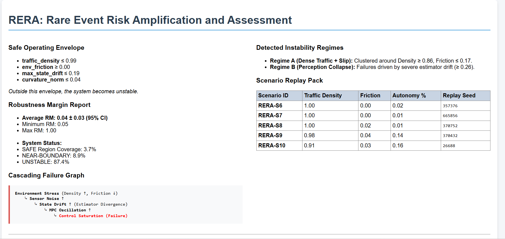
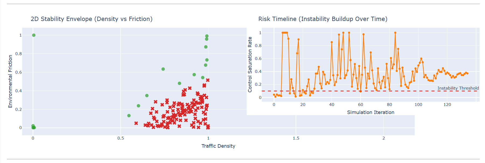
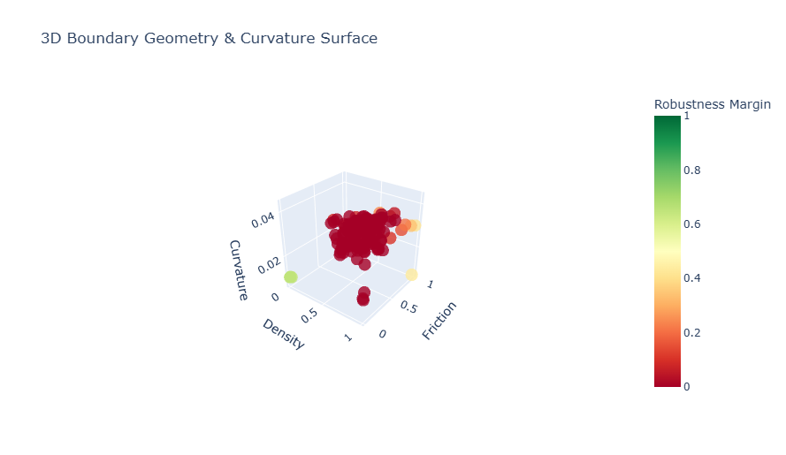

# RERA: Rare Event Risk Amplification and Assessment

**A GPU-accelerated system for discovering failure boundaries, explaining system instability, and generating structured risk assessments from simulation data.**

 

> **The Problem:** Simulation systems tell  *when* a failure occurs.  
> **The Gap:** They rarely explain *why it happened* or *where the system becomes unsafe*.  
> **RERA:** Identifies rare failure conditions, maps system boundaries, and extracts causal explanations from simulation data.

---

##  What RERA Does

RERA is a **simulation data analysis and validation pipeline** designed to:

- Discover **rare failure scenarios** in high-dimensional environments  
- Map **safe vs. unstable operating regions** (Operational Design Domain)  
- Extract **causal failure chains** from telemetry  
- Generate **reproducible debugging scenarios**  
- Produce **structured risk and safety reports**

RERA is not a simulator — it is a **failure analysis and insight layer built on top of simulation environments**.

Most systems answer: Did the system fail?  
RERA answers: Why did system fail, where will system fail again, and how close system is to that boundary?

---
## Demo

https://github.com/user-attachments/assets/47bfcd01-dca5-4f78-9780-2071272e7d97

---

##  Results

  
  
  
  
  

---

##  Core Architecture

RERA runs inside a GPU-accelerated Docker environment and is designed for **high-throughput scenario evaluation and analysis**.

### Pipeline Overview

1. **Boundary-Focused Scenario Search**  
   Uses ensemble-driven exploration to prioritize failure-prone regions instead of random sampling.

2. **Scenario Realization (Digital Twin Integration)**  
   Converts edge-case parameters into executable simulation scenes (Omniverse / DRIVE Sim compatible).

3. **High-Fidelity Execution**  
   Runs scenarios with realistic sensor and physics models to capture system behavior under stress.

4. **Boundary Geometry Analysis**  
   Computes curvature and instability characteristics to distinguish:
   - gradual degradation  
   - sharp failure boundaries  

5. **Operational Envelope Mapping**  
   Identifies:
   - safe regions  
   - instability regimes  
   - robustness margins (RM)

6. **Causal Root-Cause Extraction**  
   Builds structured failure chains:
   Environment → Sensor Noise → State Drift → Controller Instability → Failure

7. **Structured Risk Output (SOTIF-Inspired)**  
   Generates machine-readable reports describing:
   - system limits  
   - failure causes  
   - mitigation requirements  

---

##  Outputs

Each run produces a complete analysis package in `/results`:

### certification_report.html
- Interactive dashboard  
- Operational Design Domain visualization  
- Failure regimes and boundary plots  
- Risk timelines and metrics  

### sotif_compliance_dossier.json
- Structured system health summary  
- Verified safe scenarios  
- Identified hazard conditions  
- Causal fault classification  

### Execution Logs
RERA_execution_[TIMESTAMP].log  
- Full pipeline trace  
- Suitable for monitoring / CI integration  

### Auto-Repair Suggestions
- Parameter tuning hints (e.g., controller / covariance adjustments)  
- Derived from observed failure behavior  

---

##  Key Capabilities

**Rare Event Discovery**  
Focuses computation on high-risk edge cases.

**Boundary Awareness**  
Understands where the system stops working.

**Causal Insight**  
Explains why failures happen.

**Reproducibility**  
All failure scenarios are replayable and debuggable.

---

##  Quick Start

### Clone & Build
git clone

cd RERA

docker build -t rera -f docker/Dockerfile .

### Run
docker run --rm --gpus all -v "%cd%\results:/app/results" rera

Refer docs/User Manual for detailed usage.
---

##  Use Cases

- Autonomous driving validation  
- Robotics simulation testing  
- Edge-case discovery  
- Simulation data analysis  
- Debugging unstable control systems  

---

## 🔗 Dependencies & Acknowledgements

RERA builds on top of:

SMARTS (Scalable Multi-Agent Reinforcement Learning Training School)  
https://github.com/huawei-noah/SMARTS  

RERA extends SMARTS with:
- boundary-focused search  
- failure analysis  
- causal extraction  
- robustness evaluation  
- structured reporting  

RERA is a **simulation analysis layer**, not a simulator.

---

##  Notes

- Provides risk assessment, not certification  
- SOTIF outputs are approximations  
- Designed for engineering insight  

---

